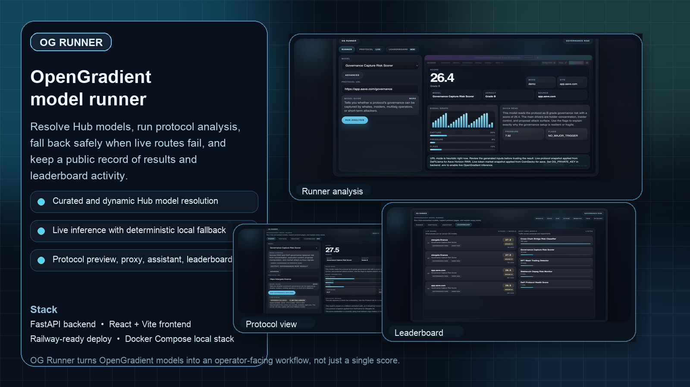
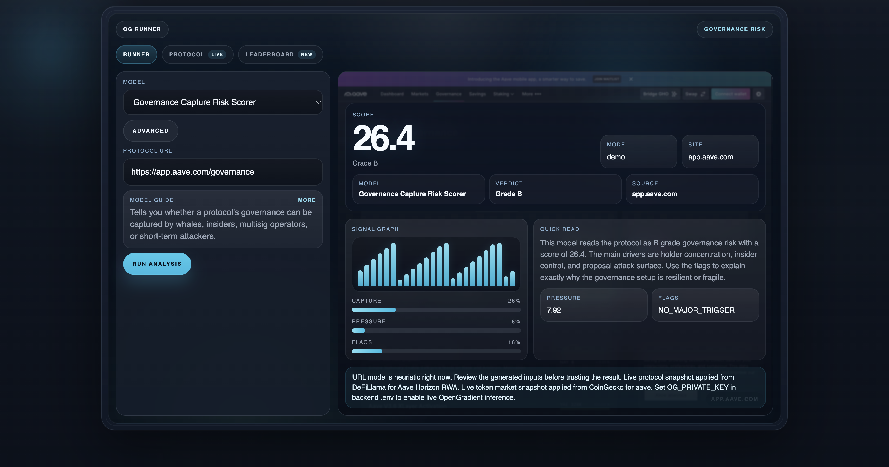
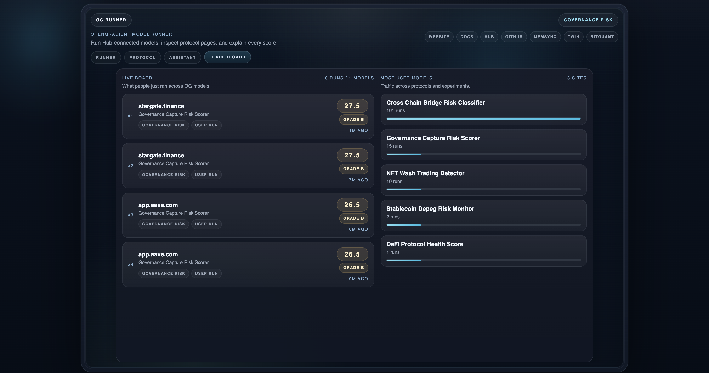

# OG Runner

<p align="center">
  
</p>

<p align="center">
  <strong>OpenGradient model runner for protocol analysis, live or fallback inference, and leaderboard-driven evaluation.</strong>
</p>

<p align="center">
  
  
  
  
</p>

<p align="center">
  <a href="https://github.com/golldyck/og-runner">Repository</a>
  ·
  <a href="https://og-runner-production.up.railway.app/">Live Demo</a>
  ·
  <a href="https://www.opengradient.ai/">OpenGradient</a>
  ·
  <a href="https://hub.opengradient.ai/">Model Hub</a>
  ·
  <a href="https://docs.opengradient.ai/">Docs</a>
</p>

## Overview

OG Runner is a full-stack OpenGradient product shell for resolving models, running protocol analysis, inspecting model outputs, and keeping a live record of what was executed. It combines a FastAPI backend with a React + Vite frontend and is now tuned for a practical `Base Sepolia + OPG` stack: local model execution for the scoring path, plus OpenGradient-backed live LLM explanations.

This repository is built for a practical workflow:

- resolve a model from a curated slug, a Hub URL, or a Hub author/name reference
- run analysis against manual inputs, demo inputs, or a real protocol URL
- enrich outputs with protocol preview, market context, and AI explanation
- persist runs into global and bridge leaderboards
- package new model concepts under `model-packs/`

## At a Glance

- `Problem`: model demos usually stop at a single score and hide the operator workflow
- `Solution`: OG Runner turns model execution into a full product loop with protocol context, explanation, and persistent run tracking
- `Audience`: OpenGradient builders, protocol researchers, risk operators, demo environments, and model-pack authors
- `Deployment shape`: works as local dev stack, Docker Compose app, or single-service Railway deploy

## Why This Project Exists

Most AI-model demos stop at a single score. OG Runner is built around the full operator workflow: choose a model, point it at a protocol, inspect the reasoning, compare outputs, and keep a running history of what was analyzed.

It is designed to be useful in both of these states:

- `base + opg`: local scoring stays available while OpenGradient LLM explanations run from the configured Base wallet
- `extended live`: optional OpenGradient live inference can be enabled separately when that route is available for your deployment

That makes the repo suitable both for real OpenGradient-connected demos and for deterministic local development.

## What OG Runner Does

### 1. Model Resolution

OG Runner can resolve:

- curated Goldy model slugs
- OpenGradient Hub URLs
- `author/model-name` Hub references

The backend also supports dynamic Hub model metadata fetches when a model exists remotely but is not hardcoded in the local registry.

### 2. Execution Modes

The runner supports three execution paths:

- `demo`: deterministic local output based on sample inputs and protocol heuristics
- `live`: optional OpenGradient inference against the configured model CID
- `fallback`: local execution when live inference or LLM explanation is temporarily unavailable

The default production profile in this repository is `Base Sepolia + OPG`: scoring runs locally, LLM explanations run live through OpenGradient, and on-chain model inference stays optional.

### 3. Protocol-Aware Analysis

OG Runner is not only a form UI. It includes:

- protocol metadata preview
- protocol HTML proxy rendering for embedded inspection
- market-context enrichment
- comparison runs between two protocol URLs
- wallet preflight checks for live OpenGradient usage

### 4. Persistent Leaderboards

Every run can be written into local JSON-backed records and surfaced in:

- a bridge leaderboard for bridge-specific risk analysis
- a global leaderboard spanning all model categories
- most-used model stats for recent operator activity

## Current Model Catalog

The curated registry currently includes:

- `Governance Capture Risk Scorer`
- `Cross-Chain Bridge Risk Classifier`
- `DeFi Protocol Health Score`
- `Stablecoin Depeg Risk Monitor`
- `DEX Liquidity Exit Risk Scorer`
- `NFT Wash Trading Detector`

Tracked model packs in this repository:

- `model-packs/dex-liquidity-exit-risk-scorer`
- `model-packs/cross-dex-arbitrage-pressure-index`

## Product Walkthrough

1. Pick a model from the runner or paste an OpenGradient Hub URL.
2. Add a target protocol URL or use demo input.
3. Run the model through live inference or fallback execution.
4. Inspect score, verdict, parameter scales, warnings, and explanation.
5. Review protocol preview, compare another target, and watch the leaderboard update.

## Demo Workflow

The fastest way to understand the product is:

1. Open the runner and choose `Governance Capture Risk Scorer`.
2. Paste a protocol URL such as `https://app.aave.com/governance` or `https://stargate.finance`.
3. Run in `demo` mode first to verify the output shape and explanation path.
4. If `OG_PRIVATE_KEY` is configured, verify wallet preflight and live explanation readiness.
5. Inspect the protocol tab, then move to leaderboard to see how the run compares with prior entries.

## Screenshots

<p align="center">
  
</p>

<p align="center">
  
  
</p>

## Architecture

```text
og-runner/
├── backend/       # FastAPI API, live/fallback orchestration, persistence, protocol helpers
├── frontend/      # React + Vite product UI for runner, protocol view, assistant, leaderboards
├── model-packs/   # Packaged model artifacts, metadata, reports, ONNX builders
└── docs/assets/   # GitHub presentation images used in this README
```

### Backend responsibilities

- expose `/health` and the `/api/*` surface
- resolve local and remote Hub models
- run demo or live OpenGradient inference
- generate assistant output through TEE LLM or local fallback
- fetch protocol preview and market context
- persist recent runs into local leaderboard storage
- serve the built frontend in single-service Railway deploys

### Frontend responsibilities

- drive the main runner workflow
- surface live/fallback execution status
- render model-aware result cards and parameter scales
- show protocol view, leaderboard tabs, and usage stats
- handle model switching, comparison flows, and explanation display

## API Surface

Core endpoints:

- `GET /health`
- `GET /api/wallet/preflight`
- `GET /api/assistant/models`
- `POST /api/assistant`
- `GET /api/models`
- `GET /api/models/search`
- `POST /api/models/resolve`
- `POST /api/models/run`
- `GET /api/protocol/preview`
- `GET /api/protocol/render`
- `POST /api/market/context`
- `GET /api/leaderboards/global`
- `GET /api/leaderboards/bridges`

## Local Development

### Backend

```bash
cd backend
python3 -m venv .venv
source .venv/bin/activate
pip install -r requirements.txt
cp .env.example .env
uvicorn app.main:app --reload
```

Backend runs on `http://127.0.0.1:8000`.

### Frontend

```bash
cd frontend
npm install
cp .env.example .env
npm run dev
```

Frontend runs on `http://127.0.0.1:5173`.

## Docker Compose

Run the full stack locally with the frontend reverse-proxying API traffic to the backend:

```bash
cp .env.example .env
docker compose up --build
```

Services:

- frontend: `http://127.0.0.1:8080`
- backend: `http://127.0.0.1:8000`

## Railway Deployment

This repository is already structured for a single-service Railway deploy from the repository root.

- root config: `railway.json`
- root Dockerfile builds frontend assets and copies them into the Python runtime
- FastAPI serves both the API and the built frontend

Recommended environment variables:

- `CORS_ORIGINS=["https://${{RAILWAY_PUBLIC_DOMAIN}}"]`
- `OG_PRIVATE_KEY=...`
- `OG_ENABLE_LIVE_INFERENCE=false`
- `OG_ENABLE_LIVE_LLM=true|false`
- `OG_RPC_URL=https://ogevmdevnet.opengradient.ai`
- `OG_API_URL=https://sdk-devnet.opengradient.ai`
- `OG_INFERENCE_CONTRACT_ADDRESS=0x8383C9bD7462F12Eb996DD02F78234C0421A6FaE`
- `OG_TEE_LLM_MODEL=GPT_5_MINI`

## Environment Notes

### Backend

See `backend/.env.example`.

- `OG_PRIVATE_KEY` enables the Base wallet used for OpenGradient-backed LLM calls
- `OG_ENABLE_LIVE_INFERENCE` controls optional on-chain model inference and is disabled by default in this stack
- `OG_ENABLE_LIVE_LLM` controls TEE LLM explanations
- `OG_LIVE_STRICT` disables silent fallback when live routes fail

### Frontend

See `frontend/.env.example`.

- `VITE_API_BASE_URL` points the UI to the backend when not using the local proxy path

## Verification

Frontend:

```bash
cd frontend
npm run lint
npm run build
```

Backend:

```bash
python3 -m compileall backend/app
```

Containers:

```bash
docker compose build
```

## Roadmap

- add richer protocol extraction for more accurate URL-driven inputs
- expand model-pack coverage beyond the current curated risk set
- add cleaner run history management and export flows
- refine assistant prompts and live/fallback observability
- improve public demo deployment ergonomics

## FAQ

### Does OG Runner require live OpenGradient connectivity?

No. The runner is intentionally built to stay functional when live routes are unavailable. Demo and fallback flows keep the UI, scoring path, and operator workflow usable during local development and degraded remote conditions.

### Where are leaderboard runs stored?

Recent runs are persisted as JSON records inside the backend data layer and then surfaced through the bridge and global leaderboard endpoints.

### Can this resolve models outside the local curated registry?

Yes. The backend can resolve Hub references dynamically when the model exists remotely and can be described from OpenGradient Hub metadata.

### Is this only a frontend demo?

No. The repository includes the frontend, the FastAPI execution layer, model resolution logic, live/fallback orchestration, protocol helpers, and deployment configuration.

## Contributing

Contributions are welcome if they improve:

- model pack quality
- protocol extraction logic
- leaderboard usefulness
- frontend UX clarity
- deployment stability

Before opening a PR, run the verification commands listed above.

## License

MIT. See `LICENSE`.
